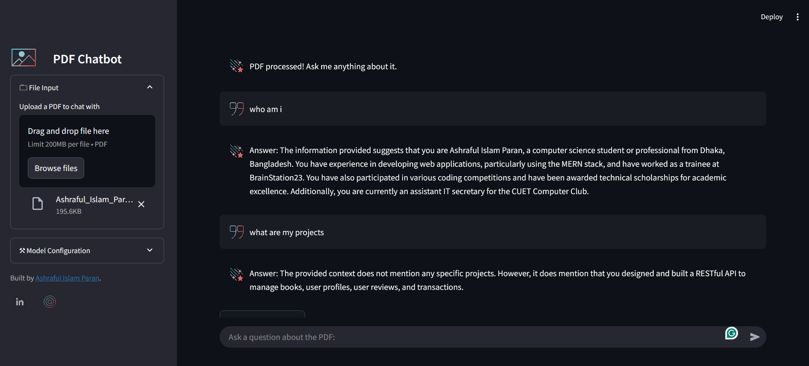

# ChatWithPDF-Rag-App


<video controls src="2025-03-2211-32-37-ezgif.com-gif-maker.mkv" title="Title"></video>
## Prerequisites

1. **Python**: Ensure Python 3.11 or later is installed.
2. **Dependencies**: Install the required Python packages listed in `requirements.txt`.
3. **Hugging Face Token**: Obtain a Hugging Face API token from [Hugging Face](https://huggingface.co/).

## Setup Instructions

1. **Clone the Repository**:
   ```bash
   git clone https://github.com/ashrafulparan2/ChatWithPDF-Rag-App.git
   cd ChatWithPDF-Rag-App

2. **Install Dependencies:**
Use the following command to install the required Python packages:
 ```bash
pip install -r requirements.txt
```
2. **Prepare the Vectorstore:** Ensure the FAISS vectorstore files (index.faiss and index.pkl) are present in the vectorstore/db_faiss/ directory. These files are required for the application to function.

2. **Set Up Hugging Face Authentication:** Log in to Hugging Face using your API token:
 ```bash
huggingface-cli login
```
2. **Run the Application:** Start the Streamlit application:
 ```bash
streamlit run app.py --server.enableCORS false --server.enableXsrfProtection false
```

2. **Access the Application:** Open your browser and navigate to http://localhost:8501 to interact with the app.


## Features
**Question Answering:** Ask questions about any PDF

**Custom Prompt:** Uses a custom prompt to ensure accurate and context-aware responses.
Source Documents: Displays the source documents used to generate the answer.

## Notes
The application uses the sentence-transformers/all-MiniLM-L6-v2 model for embeddings and the mistralai/Mistral-7B-Instruct-v0.3 model for language generation.
Ensure the FAISS vectorstore is correctly set up before running the app.
## Troubleshooting
If the app fails to load, verify that all dependencies are installed and the Hugging Face token is correctly configured.
Ensure the vectorstore files are not corrupted and are in the correct directory.
